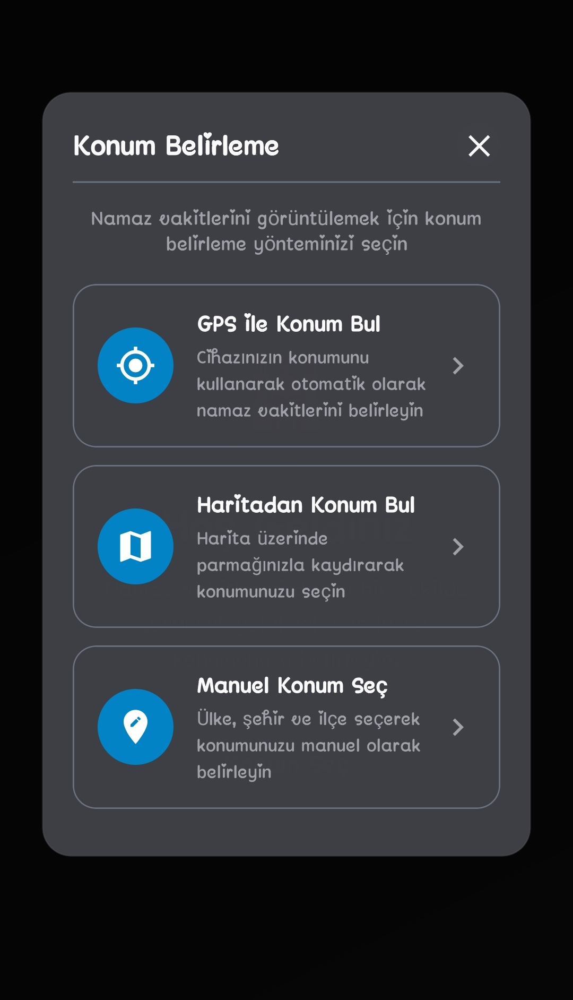
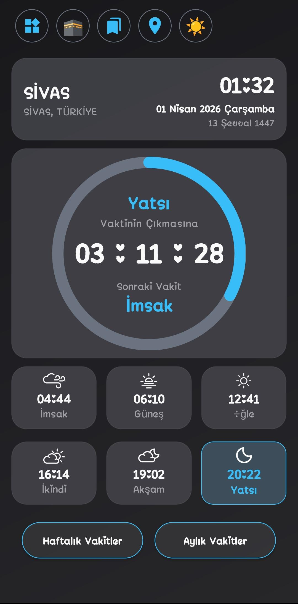
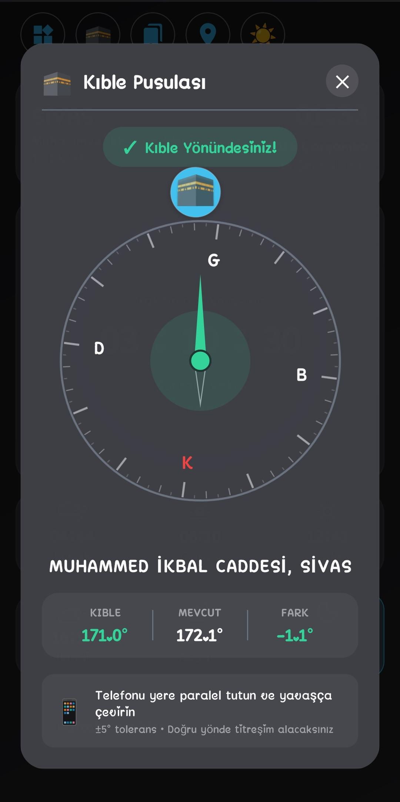

# NamazVakti

Konum tabanlı namaz vakitleri uygulaması (React Native + TypeScript).

Bu doküman, uygulamayı sıfırdan kendi bilgisayarına kurup çalıştırmak isteyen kullanıcılar ve geliştiriciler için hazırlandı.

## Önemli Not

Bu proje şu anda yalnızca **Android** için test edilmiştir.

- Android dışı platformlar aktif olarak test edilmemiştir.
- README bu nedenle yalnızca Android kurulum adımlarını içerir.

## Özellikler

- Günlük / haftalık / aylık namaz vakitleri
- GPS ve manuel konum seçimi
- Çevrimdışı kullanım için yerel önbellek
- Kıble pusulası (manyetometre sensörü)
- Haritadan konum seçimi (WebView + OpenStreetMap)
- Android ana ekran widget desteği
- Açık / koyu tema

## Teknoloji Yığını

- React Native 0.75.3
- React 18.3.1
- TypeScript
- Axios
- AsyncStorage
- NetInfo
- Reanimated
- React Native WebView
- React Native Sensors
- Android native module (Kotlin)

## Ekran Görüntüleri

<table>
	<tr>
		<th>konum-belirleme.png</th>
		<th>ana-ekran.png</th>
		<th>kible-pusulasi.png</th>
	</tr>
	<tr>
		<td align="center">
			
		</td>
		<td align="center">
			
		</td>
		<td align="center">
			
		</td>
	</tr>
	<tr>
		<td>Konum belirleme yöntemleri ekranı (GPS, harita ve manuel seçim).</td>
		<td>Anlık vakit, geri sayım ve günlük vakit kartlarının bulunduğu ana ekran.</td>
		<td>Kıble yönünü derece farkı ile gösteren pusula ekranı.</td>
	</tr>
</table>

## Gereksinimler (Android)

Kod tabanı ve Android yapılandırmalarına göre gerekli sürümler:

1. Node.js 18 veya üzeri (`package.json` -> `engines.node >= 18`)
2. npm
3. Git
4. JDK 17 (önerilen)
5. Android Studio
6. Android SDK bileşenleri:
	- Android SDK Platform 34
	- Android SDK Build-Tools 34.0.0
	- Android SDK Platform-Tools (adb)
	- Android Emulator
7. NDK 26.1.10909125 (projede tanımlı)

Projeden doğrulanan Android build bilgileri:

- `compileSdkVersion`: 34
- `targetSdkVersion`: 34
- `minSdkVersion`: 23
- `kotlinVersion`: 1.9.24
- `gradle`: 8.8

Not: Bu proje React Native CLI tabanlıdır, Expo projesi değildir.

## 1) Repoyu İndir

```bash
git clone https://github.com/furkandogan1362/NamazVakti.git
cd NamazVakti
```

## 2) JavaScript Paketlerini Kur

Proje için gerekli tüm JS paketleri `package.json` içinde tanımlıdır.

```bash
npm install
```

## 3) Android Ortamını Hazırla

Android Studio içinde şu adımları tamamla:

1. SDK Manager'dan Platform 34 ve Build-Tools 34.0.0 kur
2. SDK Tools bölümünden Android SDK Command-line Tools ve Platform-Tools kur
3. Device Manager ile en az bir emulator (AVD) oluştur
4. Emulatorü başlat veya USB hata ayıklama açık fiziksel cihaz bağla

Windows için PATH değişkenleri(Genellikle kurulum sırasında otomatik eklenir.Yeniden başlatma gerekebilir.):

- `ANDROID_HOME` veya `ANDROID_SDK_ROOT`
- `%ANDROID_HOME%\platform-tools`
- `%ANDROID_HOME%\emulator`

Doğrulama:

```bash
adb devices
```

## 4) Uygulamayı Çalıştır

### 4.1 Metro başlat

```bash
npm start
```

### 4.2 Android uygulamasını çalıştır

Yeni bir terminalde:

```bash
npm run android
```

## Kullanılabilir NPM Scriptleri

- `npm start` -> Metro bundler
- `npm run android` -> Android debug çalıştırma
- `npm run lint` -> ESLint kontrolü
- `npm test` -> Jest testleri

## Android İzinleri ve Widget Notu

Uygulama Android tarafında aşağıdaki yetenekleri kullanır:

- Konum (GPS) izinleri
- Bildirim izinleri
- Arka plan servisleri
- Cihaz yeniden başlatıldığında servis/işleyiş devamı
- Widget güncelleme alarmları

Widget davranışı cihaz üreticisine göre farklı olabilir (özellikle batarya optimizasyonu ve otomatik başlatma kısıtları).

Gerekirse şu ayarları kontrol et:

1. Battery optimization istisnası
2. Bildirim izinleri
3. Otomatik başlatma (üreticiye göre değişir)

## Sorun Giderme

### 1) Android build hataları

Windows:

```bash
cd android
gradlew clean
cd ..
npm run android
```

### 2) Metro cache temizleme

```bash
npx react-native start --reset-cache
```

### 3) Cihaz görünmüyor

```bash
adb devices
```

Liste boşsa:

1. Emulatorün açık olduğundan emin ol
2. Fiziksel cihazda USB hata ayıklamayı aç
3. Gerekirse adb'yi yeniden başlat:

```bash
adb kill-server
adb start-server
adb devices
```

## Proje Yapısı (Kısa)

- `src/components`: UI bileşenleri
- `src/hooks`: İş mantığı (custom hook'lar)
- `src/contexts`: Global state (tema, ağ, konum)
- `src/services`: Storage ve widget servisleri
- `src/api`: Diyanet API entegrasyonu
- `android`: Native Android kodları (widget dahil)

